# Sane Subscription Feed

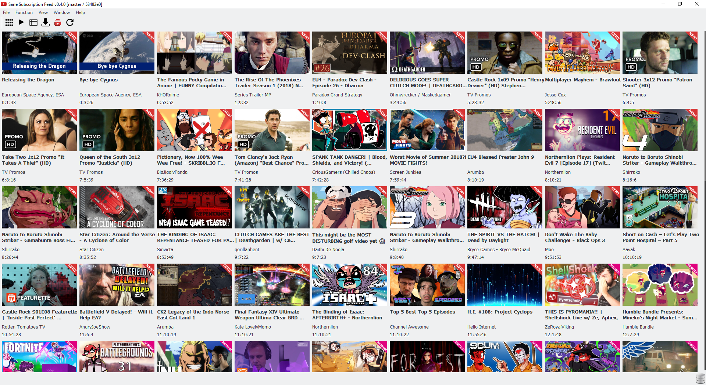

## How it works
Instead of directly accessing YouTube's unreliable subscription feed  (which already has been processed through the infamous "algorithm") it retrieves your subscriptions list and then queries the YouTube API for each channel separately ([using a mix of videos.search and videos.list](https://github.com/BluABK/sane-subfeed/wiki/Missed-videos-(and-tests)#youtube-apis-list-and-search)).

### Compatibility
This code is primarily tested on the following platforms:

| Operating System          | Python | PyQt | Arch  | Tester(s)                                |
|:-------------------------:|:------:|:----:|:-----:|:----------------------------------------:| 
| Windows 10                | 3.7.0  | 5.11 | x64   | [BluABK][user_bluabk], [Acca][user_acca] |
| Linux/Debian 9 (stable)   | 3.5.3  | 5.10 | x64   | [BluABK][user_bluabk]                    |
| Linux/Arch                | 3.7.0  | 5.11 | x64   | [Kitsuna][user_kitsuna]                  |

## Installation and setup
### 1. Prerequisites
*   Python 3 (3.5+ is recommended, 3.7+ is encouraged)
*   The pip package management tool (usually bundled with python installation)

### 2. Requirements:
*   Python 3.6 and above: `pip install -r requirements.txt`
*   Python 3.5 and below: `pip install -r requirements-py35.txt`

### 3. Set up OAuth and API keys (pick _one_ option)
OAuth is required for access to your own youtube account (like retrieving subscriptions list). 
For anything else API keys is usually what gets used.

#### Option A: Use public/pre-made
Caution: This option is prone to daily API quota limit issues, option B is highly encouraged.
  1. Rename `sane_yt_subfeed/resources/keys_public.json` to `keys.json`
  2. Rename `sane_yt_subfeed/resources/client_secret_public.json` to `client_secret.json`

#### Option B: Set up your own
Useful ref: https://developers.google.com/youtube/v3/getting-started

  Go to https://console.developers.google.com/apis/dashboard and follow these steps:
  1. Click the drop-down next to the "Google APIs" logo in the banner area (upper left corner).
  2. Click "New Project".
  3. Fill in forms and create.
  4. Click the (presumably blue) "Enable APIs and services" text.
  5. Search for, and select "YouTube Data API v3"
  6. Enable "YouTube Data API v3"
  7. Go to "Credentials" screen
  8. Create an API Key and copy the key into `sane_yt_subfeed/resources/keys.json.sample` and rename it `keys.json`
  9. 
     1. a) Create an OAuth Client ID
     2. b) Configure consent screen, usage type is "other".
     3. c) Download json and save it as `sane_yt_subfeed/resources/client_secret.json` 

Option B Step by Step in pictures

    

| Step 1 | Step 2 | Step 3 | Step 4 |
|--------|--------|--------|--------|
| 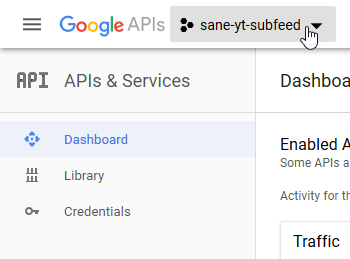 | 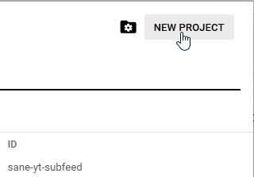 | 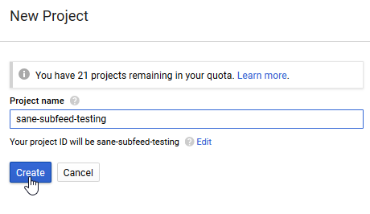 | 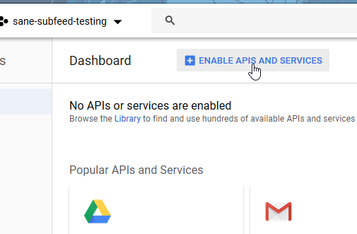 |

| Step 5 | Step 6 | Step 7 | Step 8 |
|--------|--------|--------|--------|
| 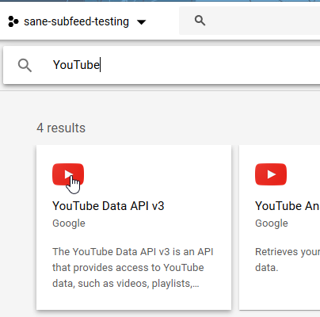 | 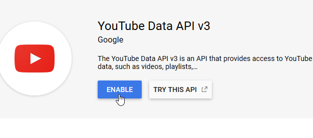 | 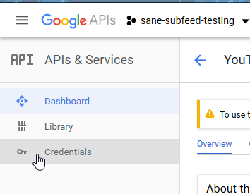 | 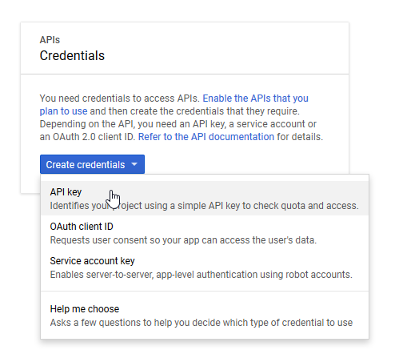 |

| Step 9a | Step 9b | Step 9c |
|---------|---------|---------|
| 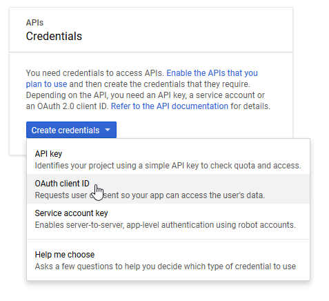 | 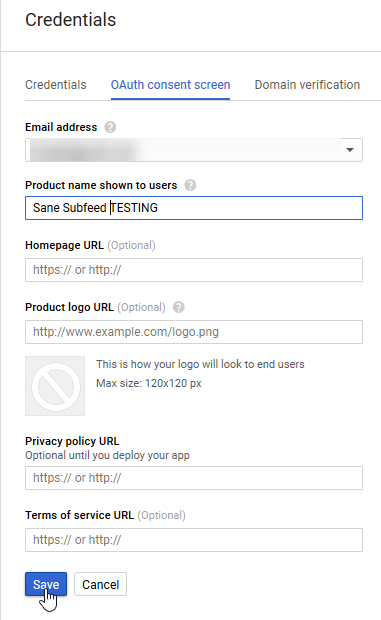 | 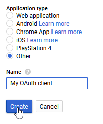 |

## Running the application
If it's the first time run: `pip install -e .` (required for non-Windows OS due to a pesky python path bug)  

Afterwards you can launch it with: `python -m sane_yt_subfeed`

## Fixes and workarounds
### Migrate Database (if required to)
1.   Add application to path (run it again, even if you've run it in the past):  
`pip install -e .`
2.   Generate migration script:  
`alembic revision --autogenerate -m "migration msg"`
3.   Migrate database:  
`alembic upgrade head`

### Notable Wiki articles
*  [Missed videos and tests](https://github.com/BluABK/sane-subfeed/wiki/Missed-videos-(and-tests))
*  [Youtube-DL Integration (and overriding the youtube_dl options)](https://github.com/BluABK/sane-subfeed/wiki/YouTube-DL-integration)

[//]: #  (Link references, variables and other black magic goes below this line.) 
[user_bluabk]: https://github.com/BluABK
[user_acca]: https://github.com/acccentor
[user_kitsuna]: https://github.com/lordkitsuna
[user_hawken]: https://github.com/hawken93
